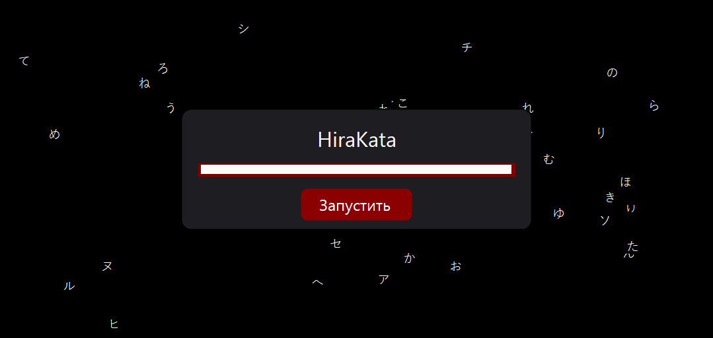
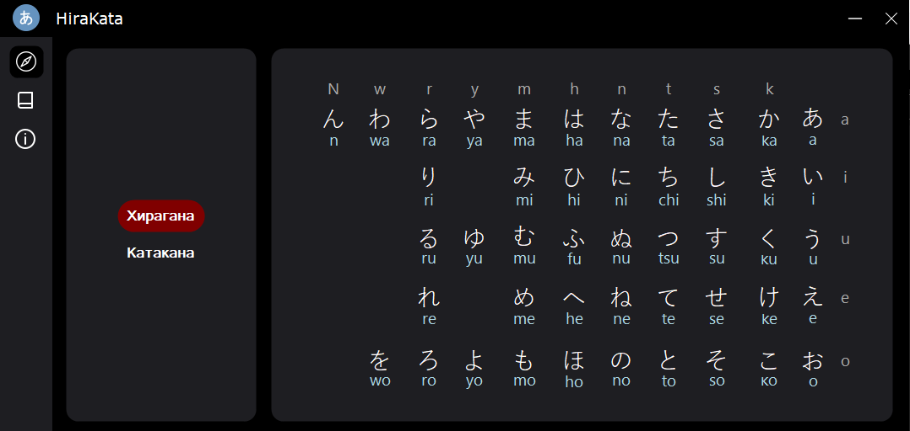
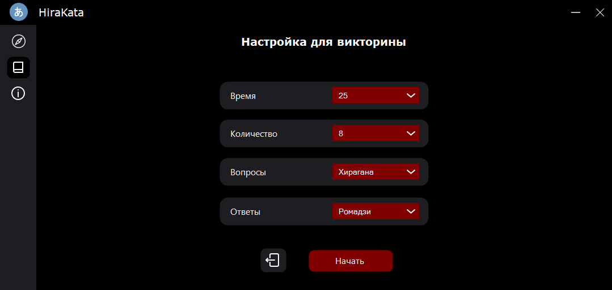
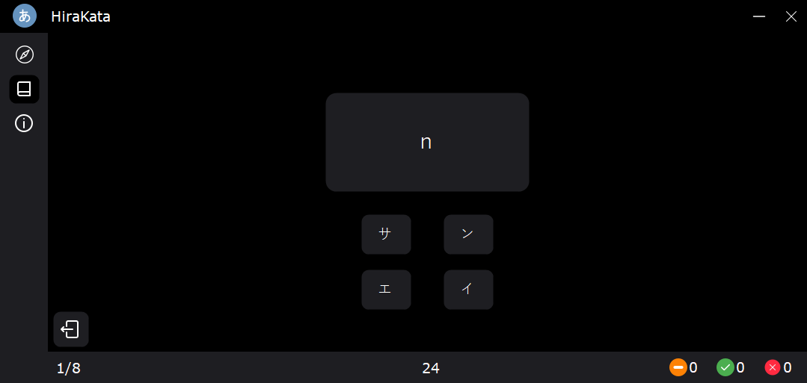
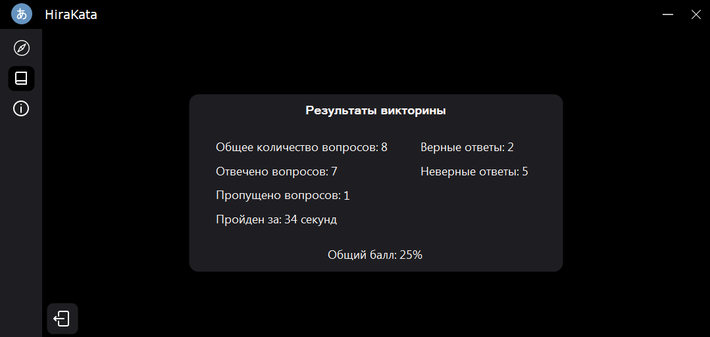
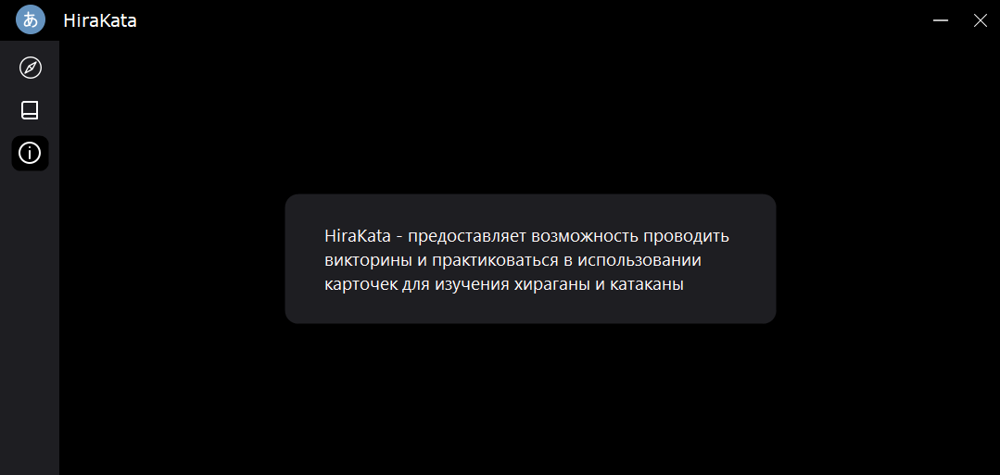

# HiraKata

[English](./en-readme.md)

## Описание

Приложение, которое предоставляет возможность проводить викторины и практиковаться в использовании карточек для изучения хираганы и катаканы.

## Screenshots

## Построен с помощью

Список основных инструментов и фреймворков, используемых в проекте.

| Инструмент/Фреймворк  | Версия      |
| --------------------- | ----------- |
| Visual Studio         | 2022 17.9.1 |
| .NET Framework        | 4.8.04084   |
| Язык программирования | C#          |

Пакеты NuGet: Отсутствуют.

<!-- ## Getting Started

Instructions on how to set up the project locally.

## Usage

Instructions on how to use the project.

## Contributing

Guidelines for contributing to the project. -->

## Лицензия

[GitHub license](./LICENSE.txt)

## Контакты

[tg](https://t.me/maxelonej)
