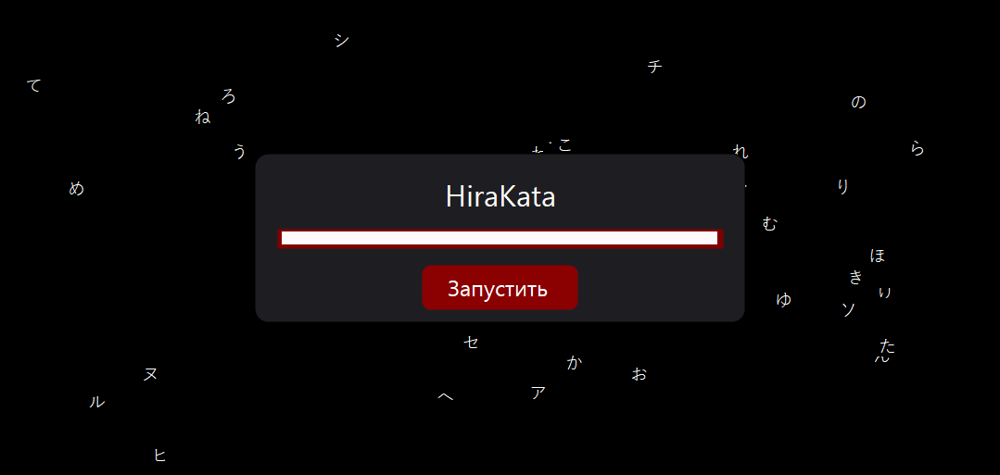
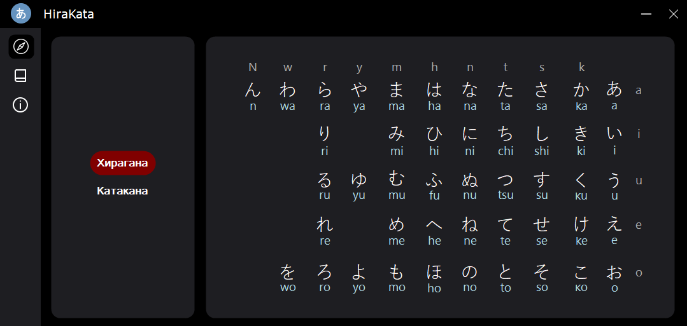
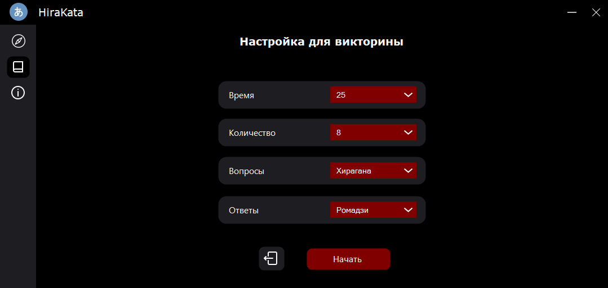
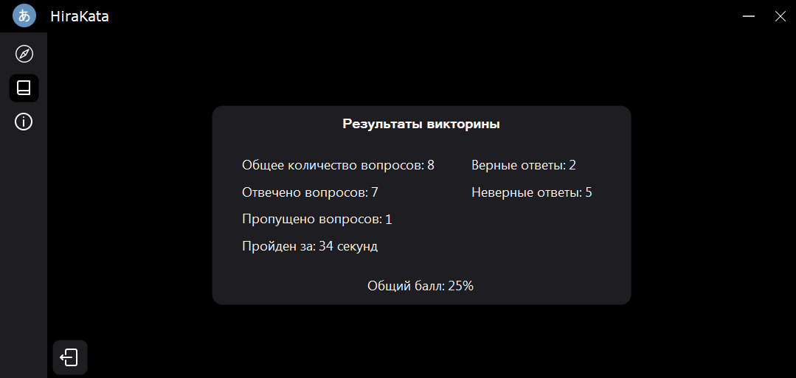

# HiraKata

[Русский](./README.md)

## Description

A desktop application that provides a quiz and flashcards practice experience for Hiragana and Katakana.

## Screenshots

## Built With

List of the main tools and frameworks used in the project.

| Tool/Framework       | Version     |
| -------------------- | ----------- |
| Visual Studio        | 2022 17.9.1 |
| .NET Framework       | 4.8.04084   |
| Programming language | C#          |

NuGet Packages: None.

<!-- ## Getting Started

Instructions on how to set up the project locally.

## Usage

Instructions on how to use the project.

## Contributing

Guidelines for contributing to the project. -->

## License

[GitHub license](./LICENSE.txt)

## Contact

[tg](https://t.me/maxelonej)
